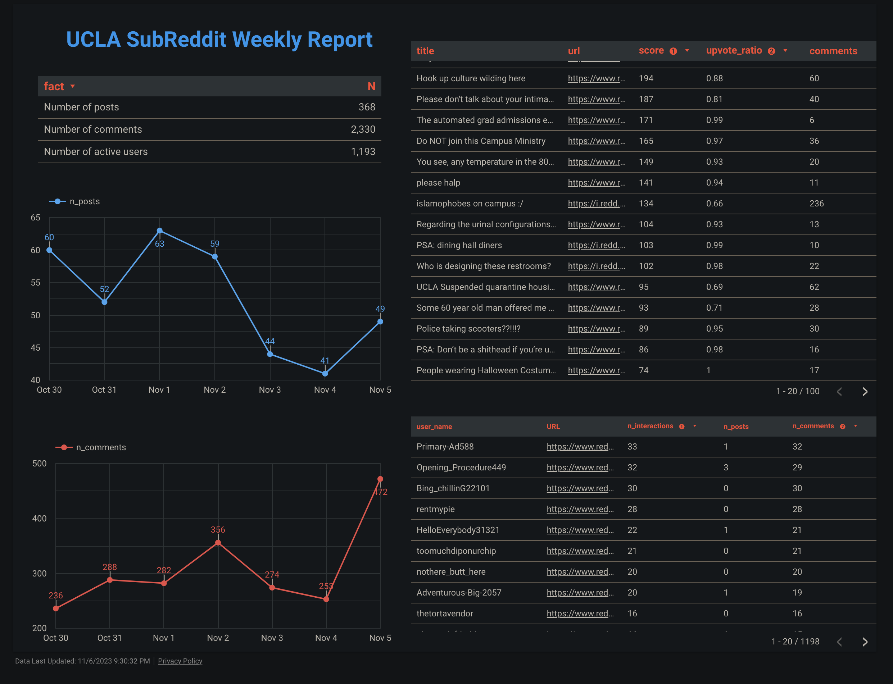
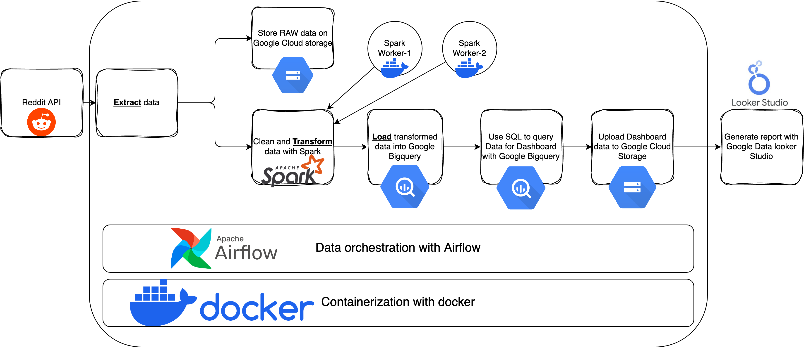
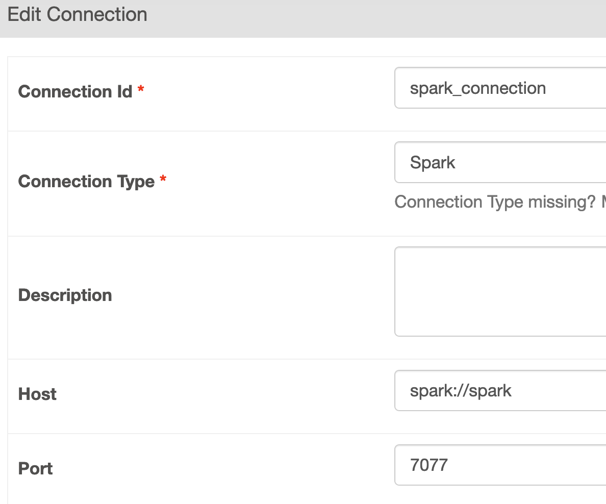

# Reddit Dashboard

## Project Description

- Generate the data dashboard for UCLA Subreddit for each week.
  - [Looker Studio Dashboard](https://lookerstudio.google.com/reporting/89878867-f944-4ab8-b842-9d3690781fba/page/CxAgD)
  - 

## Tools

1. Docker
2. Python
3. Spark
4. Airflow
5. Google Cloud Platform
   - Google Cloud Storage
   - Google BigQuery
   - Google Looker Studio
6. SQL

## Architecture



## Usage

### Create an API Account for Reddit

1. Go to [Reddit Apps Preferences](https://www.reddit.com/prefs/apps)
2. Create a web application and use the provided key and secret in the subsequent steps.

### Create Google Cloud Project

1. Visit the [Google Cloud Console](https://console.cloud.google.com/) and create a project.
2. Obtain the `project_id` (**not** the project name) to use in the following steps.

### Build the Customized Airflow Image

1. Navigate to the `airflow_image` folder.
2. Within this folder, create a `.env` file.
3. Enter the following in the `.env` file:

```bash
REDDIT_CLIENT_ID="your_client_id"
REDDIT_CLIENT_SECRET="your_client_secret"
GCP_PROJECT_ID="your_gcp_project_id"
```

4. In the `Dockerfile`, ensure the `JAVA_HOME` environment variable is set to the correct path.
5. In the Terminal/Bash, run `docker build -t reddit_airflow .`

### Get the GCP Service Account

1. Visit [Google Cloud IAM Admin](https://console.cloud.google.com/iam-admin/serviceaccounts) and create a service account.
2. Generate the json key file, place it in the `$HOME/gcp/` directory, and rename it to `gcp_key.json`.

### Run Airflow DAG

1. Go to the Airflow directory.
2. Execute `docker-compose up`.
- Visit `http://localhost:8080`.
- The username is `airflow` and the password is `airflow`.
3. The DAG to run is `reddit-data-dashboard`.

#### Add the Spark Operator in Airflow

- At `http://localhost:8080/connection/list/`, add the Spark connection with the following settings:
- 

#### Run the DAG

- On the [Airflow DAGs page](http://localhost:8080/dags/reddit-data-dashboard/grid), click the button to trigger the DAG manually.
